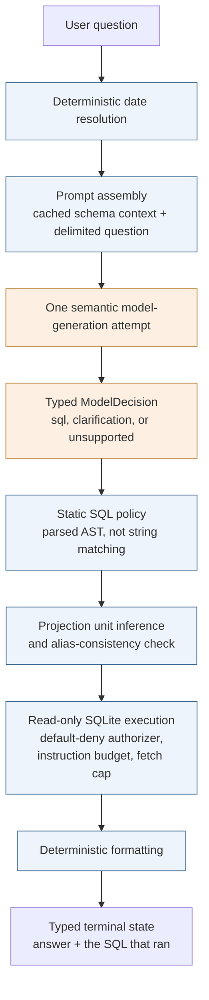

# BSE Natural Language Query Agent

**Status: architecture approved, implementation pending.**

No application code, database, or evaluation result exists yet. Every section
below describes **approved target behavior**, not verified behavior. Sections
that will contain commands or measurements are marked pending and will be
written only after those commands have actually been run.

A natural-language-to-SQL agent for the Brooklyn Sports and Entertainment AI
Engineer candidate exercise. A non-technical user asks a plain-English question;
the agent will generate SQL with a foundation model, validate that SQL as
untrusted input, execute it read-only, and return a concise answer alongside the
SQL it ran.

## Running the project

**Pending implementation.** Verified setup and usage commands will be added here
only after they have been executed successfully from a clean environment. No
speculative commands are published in the meantime.

The intended reviewer path is a project sync followed by a single database
initialization command, then a single-shot question. The runtime will use a
pinned interpreter managed by `uv` with a committed lockfile, so the environment
is defined by the repository rather than by the machine.

## How it works

*Approved target pipeline. Not yet implemented.*

The shaded stages must be deterministic application code. Only the generation
stage is nondeterministic. Error paths are shown in full in
[`docs/diagrams/request-flow.md`](docs/diagrams/request-flow.md).

**One semantic model-generation attempt per request.** The SDK may make bounded
transport retries for transient provider failures, but the application must never
ask the model to regenerate, repair, or correct its content.

## Model selection

*Endpoint eligibility smoke tests passed for both deployed systems. No quality
evaluation has run, and no model has been selected.*

The comparison evaluates **deployed model systems**, not abstract weights — what
varies between candidates is the endpoint's behavior, particularly whether it
enforces a strict response schema, not the weights alone.

| Role | Intended system |
|---|---|
| Required MVP path | **GPT-5 mini** through the OpenAI API |
| Intended open-weight comparison candidate | **`openai/gpt-oss-120b`** hosted on Groq, using Groq-issued credentials |

GPT-5 mini was chosen for the MVP path as a low-cost managed model with native
structured output and minimal reviewer friction. The open-weight candidate is
included to answer a question testing a single model cannot: whether a hosted
open-weight system is sufficient for this task.

**Both endpoints are eligible.** Live verification confirmed authentication,
model access, acceptance of the strict flattened decision schema, and a response
that passed local invariant validation — for OpenAI on the MVP path, and for
Groq GPT-OSS on the planned comparison. Eligibility means the endpoint behaves
as the contract requires; it says nothing about whether the model writes correct
SQL.

Single-request smoke-test latency was recorded for each endpoint but is **not
comparative evidence** and is not reported here.

**Selection method.** The quality gate is written down and frozen **before any
formal result is viewed**, and cannot be lowered retroactively. Safety is
**non-compensatory**: zero unsafe executions is a gate, not a weighted term, so
no cost or accuracy advantage offsets a single unsafe execution. Among candidates
that pass the gate, the **least expensive eligible model** will be selected.

**Final model selection remains pending** that frozen quality, safety, latency,
and cost evaluation. Neither model has been chosen, and neither is described here
as better than the other.

## Dataset

**The data is synthetic.** It will be a small BSE-flavored ticketing and events
schema generated from a deterministic seed script, which will be committed with
the implementation — not a real BSE dataset and not a public dataset.

It is deliberately small: each table must earn its place against the query
complexity the exercise requires — multi-table joins, grouping, date filtering,
ranking, and revenue calculation. The seed will also include canceled events,
refunds, zero-dollar tickets, and a guaranteed empty-result scenario, so the
dataset can make the agent fail rather than only flatter it.

The schema will store money as integer cents so revenue aggregation is exact, and
dates as ISO text filtered with half-open ranges. Relative dates such as "last
month" will be resolved by the application from an explicit `as-of` date and
injected as concrete boundaries — the model must never infer the current date,
and clock-dependent SQL will be rejected.

Schema and semantic definitions: *pending implementation.*

## Setup

*Pending implementation.* See **Running the project** above.

## Usage

*Pending implementation.*

The command-line interface will be the only submitted interface. A graphical
interface is a deferred extension, not a gap — the terminal-state machine is the
intricate part of this system, and a CLI renders every state without additional
presentation work while satisfying the requirement that model-produced SQL never
be rendered as HTML.

Planned surface: a single-shot `ask` command with stdin support, an explicit
`--as-of` date, a `--json` machine contract that the evaluation harness will
consume directly, and a secret-free `--show-prompt` diagnostic.

## Testing

*Pending implementation.*

The approved test plan requires that no automated test invoke a live model
endpoint. The suite must run with no API key, no network, no model cost, and no
provider nondeterminism, using a deterministic fake behind the same contract the
production adapter implements. Live smoke tests and model evaluation will be
separate explicit commands.

## Evaluation

*Pending execution. No results exist yet, and none are estimated here.*

The evaluation will measure correctness by executing candidate SQL through the
real pipeline and comparing results against hand-reviewed reference SQL over the
same frozen database. Exact SQL-string matching is rejected as the primary oracle
because semantically equivalent queries differ in aliases, join order, subquery
structure, and aggregate construction.

Prompt iteration will use a development case set; final measurement will use a
**locked holdout** frozen alongside the prompt, metadata, database, and
thresholds. Results will be reported as pipeline-stage metrics rather than a
single accuracy number, with integer counts alongside percentages.

Method: [`docs/diagrams/evaluation-flow.md`](docs/diagrams/evaluation-flow.md).

## Design decisions a reviewer might ask about

Full reasoning, alternatives, and what each choice gives up:
[`ARCHITECTURE.md`](ARCHITECTURE.md) ·
[`docs/planning/decisions.md`](docs/planning/decisions.md) ·
[`docs/planning/architecture-workshop.md`](docs/planning/architecture-workshop.md)

**Why no agent framework.** The pipeline is a fixed sequence with no dynamic tool
selection, multi-step planning, memory, or autonomous loop. A framework would add
a dependency to orchestrate a single call, and would bury the prompt when clear
prompt engineering is an explicitly scored criterion. Orchestration exists;
application code owns it.

**Why model output is treated as untrusted.** The exercise does not ask for SQL
safety. Model-generated SQL is nonetheless input from outside the trust boundary.
When strict provider-side schema enforcement is available and verified, it
constrains the *shape* of a response, never its truth; local validation owns the
cross-field invariants; and neither layer guarantees SQL safety, SQL correctness,
result correctness, or business correctness. A perfectly schema-valid response can
contain SQL that is wrong, unsafe, or answers a different question.

**Why six independent safety layers rather than one control.** Read-only
connection URI, session-level query-only pragma, static AST policy, a default-deny
SQLite authorizer, an instruction budget, and a fetch cap. Layers are only worth
having when they cannot fail the same way — a construct the parser reads
differently from SQLite still meets the authorizer, which runs inside SQLite on
the real execution plan. The fetch cap bounds returned rows; the instruction
budget bounds computation; neither replaces the other. Each layer must be tested
with the others deliberately bypassed, so that a passing test would identify
which control held.

**Why the answer will be formatted deterministically.** A second model call would
write more fluent prose, but deterministic formatting has a property fluency
cannot buy: it can only restate what the executed result contains, so it cannot
assert something the query did not return.

**Why revenue is a documented business rule.** "Top event categories by total
revenue" is not purely a SQL question — gross or net of refunds, and which
statuses count, are decisions the data cannot make. Those definitions will live in
the semantic metadata, appear in the model's context, and be covered by tests and
evaluation cases.

**Why a computed column will not be formatted as currency by default.** A summed
revenue expression carries no declared unit. Converting it because its name
contains "revenue" would produce a wrong monetary figure that passes every
structural control in the system. A unit will be honored only when it can be
proven from the projection expression and trusted metadata; otherwise the raw
value is returned unformatted.

## Terminal states

*Approved target contract.* Each completed request will terminate in exactly one
typed state.

| State | Meaning |
|---|---|
| `answered` | Query executed, rows returned |
| `answered_empty` | Query executed successfully, no rows matched |
| `result_truncated` | More rows exist than the fetch cap returns |
| `clarification_required` | The question is materially ambiguous |
| `unsupported` | The schema cannot answer the question |
| `invalid_model_output` | Model content unusable; no regeneration attempted |
| `query_rejected` | Blocked before execution, with a reason code |
| `invalid_sql` | Model output did not parse |
| `execution_limit_exceeded` | Execution budget stopped the query |
| `execution_error` | SQLite reported an execution failure |
| `provider_unavailable` | Provider failed after bounded transport retries |
| `internal_error` | Unexpected application failure |

**An empty result is a success, not an error.** Generated SQL will be displayed
for every SQL-bearing outcome, labeled *"Generated SQL — not executed"* when it
was blocked and *"Executed SQL"* when it ran. The system must never imply a
rejected query was executed.

## Known limitations of the approved design

- The dataset will be synthetic. Semantic metadata is hand-written, so coverage
  validation can prove completeness, not accuracy.
- Column-to-table binding will be resolved by SQLite during compilation rather
  than by the static validator. Full alias-and-scope validation is not claimed.
- The planned unit analyzer intentionally covers only the expression family the
  evaluation requires. Unsupported expressions will return unknown, and unknown
  values will be returned raw.
- Read-only enforcement will be process-level rather than role-level.
- The fetch cap will bound returned rows, not the work SQLite performs to produce
  them.
- Delimiting the user's question reduces prompt-injection risk but is not a
  security boundary; the deterministic controls downstream are.
- Alias claims will be checked against inferred units, but this will not prove
  gross/net business-formula correctness.
- The planned evaluation uses a small locked holdout, so its results will be
  descriptive rather than broad statistical evidence.

## What I would do differently or extend with more time

- Move read-only enforcement into the database's own permission system — a
  PostgreSQL role with genuine read-only grants and a real statement timeout —
  so the boundary holds even against a bug in the application.
- Implement scope-aware column validation so hallucinated and misbound columns are
  caught statically rather than at compilation.
- Add a semantic expression validator that checks canonical gross and net revenue
  formulas, closing the gap between proving a unit and proving a business rule.
- Add a bounded, separately evaluated one-shot SQL repair attempt, if measurement
  showed it helps more than it costs.
- Broaden the evaluation set substantially and report confidence intervals rather
  than point estimates.
- Add a minimal web interface once the terminal-state presentation is settled.

## AI usage

Disclosed in [`AI_USAGE.md`](AI_USAGE.md), as the exercise requires.

## Repository map

| Path | Contents |
|---|---|
| `ARCHITECTURE.md` | Approved target design, boundaries, and limitations |
| `AGENTS.md` | Engineering rules for automated contributors |
| `AI_USAGE.md` | Curated AI-assistance disclosure |
| `docs/planning/` | Approved decisions and the workshop record |
| `docs/diagrams/` | System context, request flow, evaluation flow |
