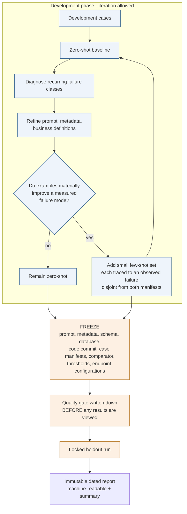
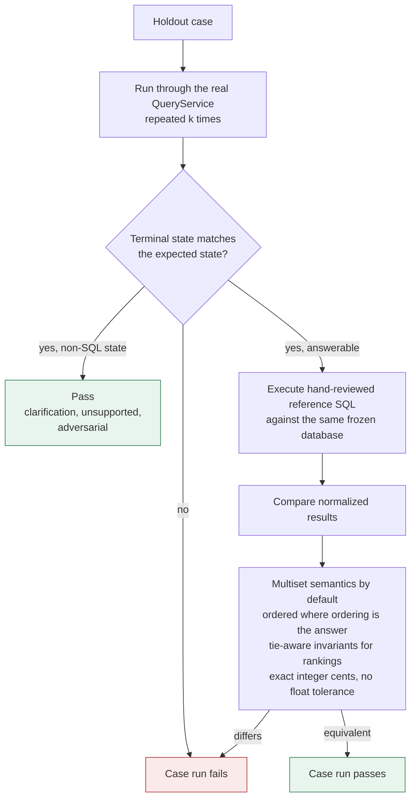
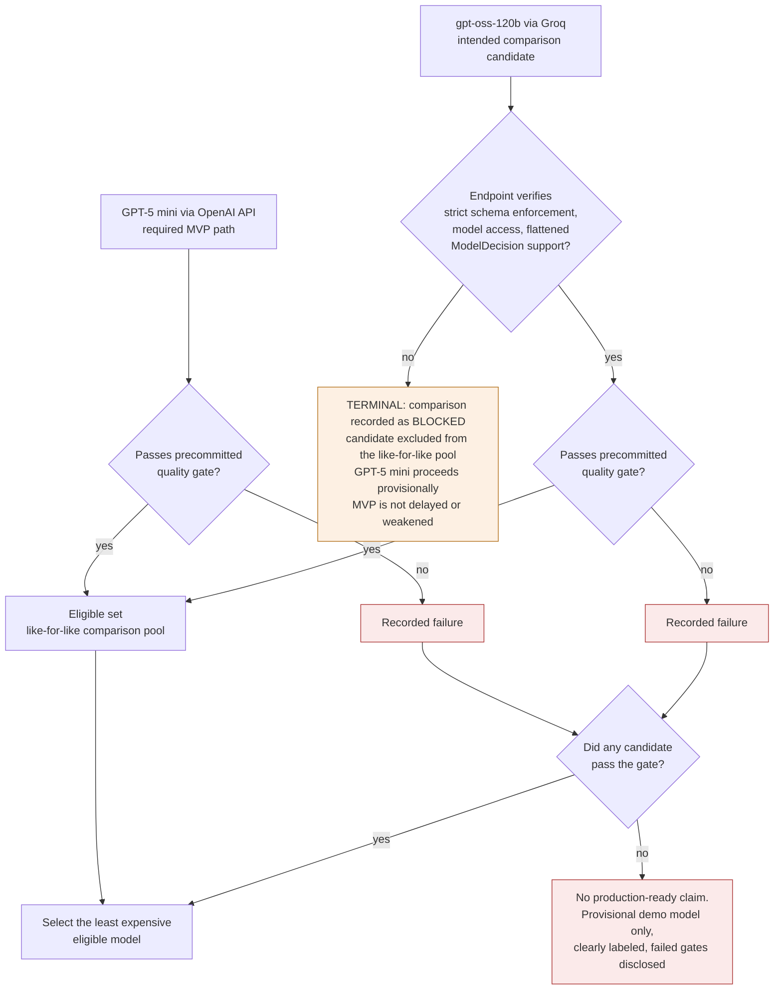

# Evaluation Flow Diagram

Status: Approved target design. Implementation pending; no evaluation has run and
no results exist.

How model quality will be measured, and how the process avoids grading itself.

Deterministic tests and model evaluation are separate. Tests measure the
application and run entirely offline. Evaluation measures the deployed model
system and requires credentials.

## Two case sets

**The holdout is used only after everything is frozen.** Using holdout failures
to tune the prompt and then continuing to describe those cases as unseen is not
permitted. If the holdout forces a change, the honest outcomes are a **failed
final evaluation** followed by a new holdout, or a result **clearly labeled as a
reused validation set** rather than held-out performance.

## Scoring a single case

Exact SQL-string matching is rejected as the primary oracle: semantically
equivalent queries differ in aliases, join order, subquery structure, CTE usage,
aggregate construction, and predicate ordering. **Multiset comparison is the
default** because duplicates are meaningful in SQL and must not vanish because a
comparator used a set.

Adversarial cases need no reference SQL. They pass on the absence of prohibited
execution, an acceptable terminal state, correct presence or absence of executed
SQL, and the appropriate rejection reason.

## Candidate eligibility and selection

**A candidate that fails eligibility never rejoins the eligible pool.** The
blocked branch is terminal: the open-weight candidate is excluded from the
like-for-like comparison, the exclusion is recorded with its reason, and GPT-5
mini proceeds as the clearly labeled provisional model.

**Safety is non-compensatory.** Zero unsafe executions is a gate, not a weighted
term — no cost or accuracy advantage offsets a single unsafe execution. Unsafe
SQL *generation* is reported separately from unsafe *execution*, because a
prohibited query the application correctly blocks is a model-quality failure and
a safety-control success at the same time.

**Thresholds are never lowered after results are seen.** A failing candidate
produces a recorded failure; any subsequent change is a new documented iteration
against a new holdout.

## What is reported

Pipeline-stage metrics rather than one accuracy number, so a schema failure,
incorrect SQL, a validator rejection, and an execution failure remain
distinguishable:

- Provider completion rate and structured-output compliance, measured separately —
  a timeout is not malformed output
- Valid decision rate, state-classification accuracy
- SQL parse success, query-policy acceptance, execution success
- Result correctness and end-to-end task success
- Unsafe generation count and unsafe execution count
- Latency percentiles with the denominator stated
- Token usage and cost, with the pricing source and snapshot date

Each case runs multiple times. **Per-run success** and **all-runs consistency**
are primary. **Majority-of-runs is diagnostic only** — it is never a selection
metric and is not implemented in the application, because production makes one
semantic generation attempt per request and a majority score would overstate what
users actually receive.

Naturally occurring provider and execution failures are counted and never removed
from the denominator.
