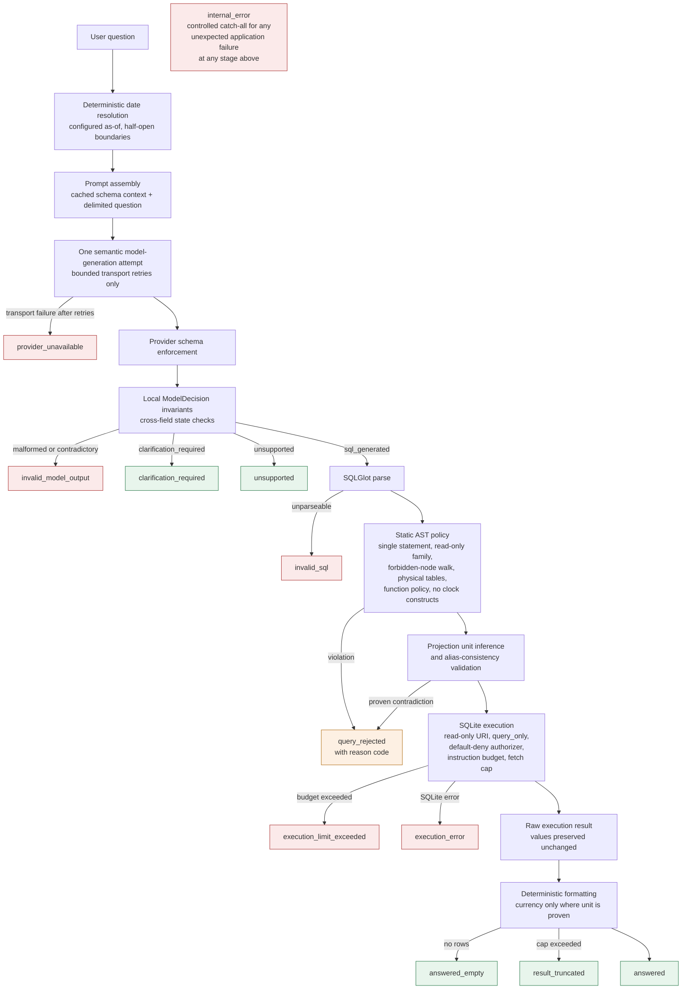
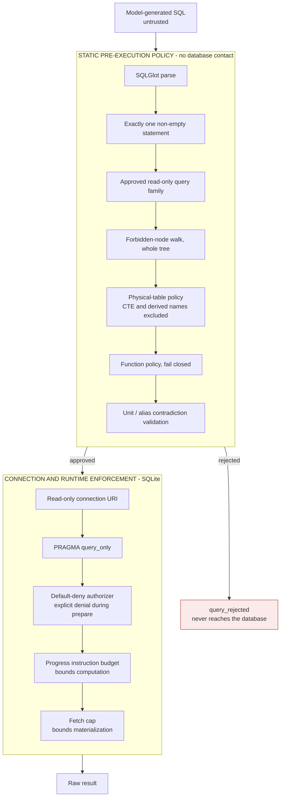

# Request Flow Diagram

Status: Approved target design. Implementation pending; diagrams describe
intended behavior, not verified behavior.

The end-to-end path for a single question, and where each terminal state is
reached.

## Pipeline

Note the ordering: **projection unit inference runs before execution**, because a
unit is a property of the query's projection expressions, not of the values that
come back.

## Terminal states

| State | Category | SQL shown | Label |
|---|---|---|---|
| `answered` | Success | Yes | Executed SQL |
| `answered_empty` | Success | Yes | Executed SQL |
| `result_truncated` | Success | Yes | Executed SQL |
| `clarification_required` | Handled semantic | None exists | — |
| `unsupported` | Handled semantic | None exists | — |
| `query_rejected` | Blocked before execution | Yes | Generated SQL — not executed |
| `invalid_sql` | Model output failure | Yes | Generated SQL — not executed |
| `invalid_model_output` | Model output failure | None exists | — |
| `execution_limit_exceeded` | Stopped by policy | Yes | Executed SQL |
| `execution_error` | Database failure | Yes | Executed SQL |
| `provider_unavailable` | Infrastructure failure | None exists | — |
| `internal_error` | Application failure | Depends | — |

An **empty result is a success**, not an error. A rejection is never described as
having been run.

## Where the pipeline deliberately stops

**Safety rejection stops** because deterministic safety policy has final
authority. Asking the model to regenerate after a rejection would create a loop
that repeatedly searches for output which passes or bypasses the validator.

**Execution failure stops** for an entirely different reason — scope. Automatic
repair would add a second model call, latency, cost, more state transitions, more
failure modes, and new evaluation requirements. It is deferred as a separately
designed and evaluated extension.

Both produce the same shape of outcome; only one of them is a security decision.

## Independent execution controls

**Nothing in the static block touches the database.** A query rejected there is
never submitted to SQLite at all. The runtime block engages only once static
policy has approved the statement.

The **six independent safety layers** are: the static AST policy as a whole
(one layer, with the checks listed above), plus the read-only connection URI,
`PRAGMA query_only`, the default-deny authorizer, the progress instruction
budget, and the fetch cap.

These layers matter because they **fail for different reasons**. A construct
SQLGlot parses differently from SQLite still meets the authorizer, which runs
inside SQLite on the real execution plan rather than on our parse tree. A
misconfigured authorizer still meets the read-only connection. No single mistake
opens a write path.

The fetch cap bounds returned materialization; the progress budget bounds
computation. Neither replaces the other.

The approved test plan requires each layer to be tested with the others
deliberately bypassed, so that a passing test would identify which control
actually held.
