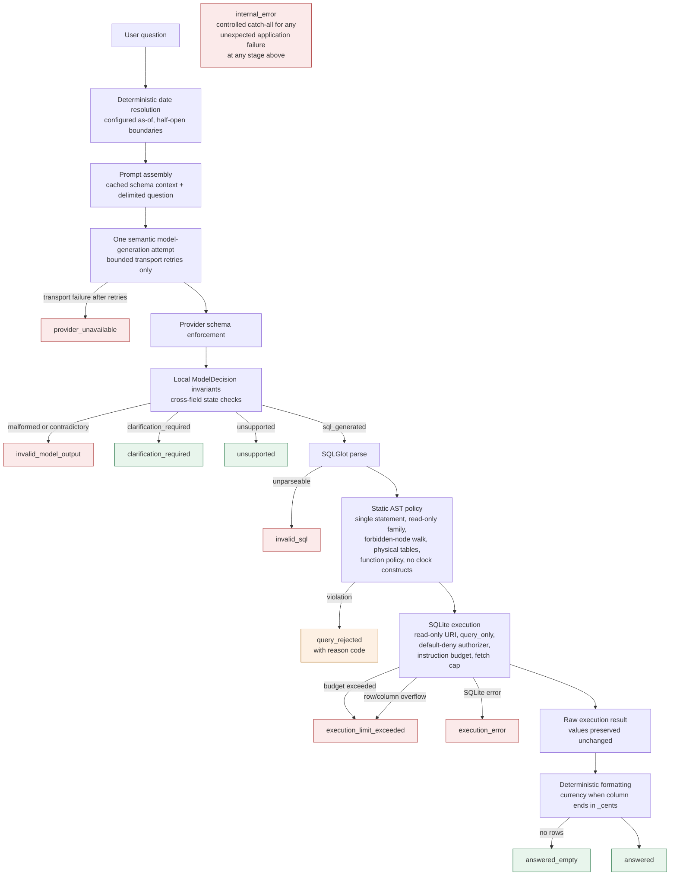
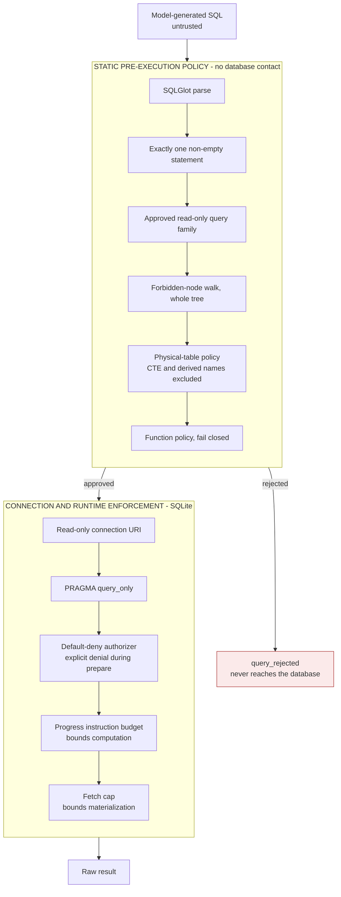

# Request Flow

> Approved design. The end-to-end request pipeline is implemented.

Currency formatting is applied after execution from the `_cents` column-name
convention, not from projection-unit inference.

Safety rejection and execution failure both stop the request. Rejection is authoritative policy; automatic execution repair is a deferred feature with separate cost, state, and evaluation requirements.
