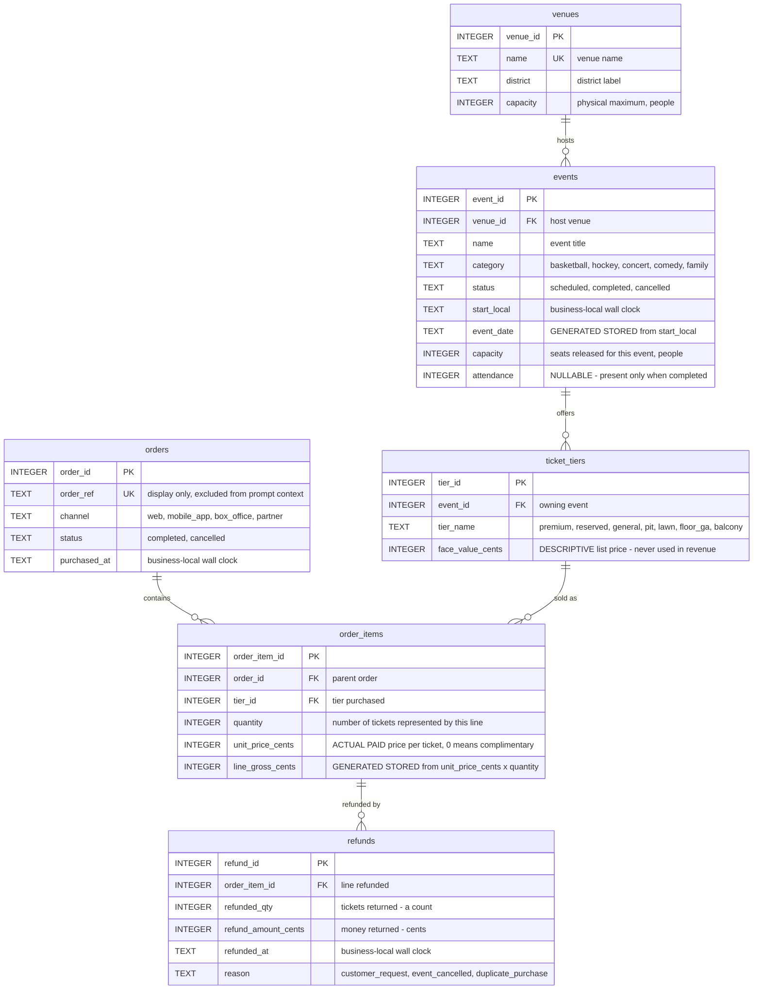

# Schema ERD

> Visual representation of the frozen physical schema. The authoritative
> contract, including CHECK expressions, indexes, and seed data, is
> [`docs/planning/schema-design.md`](../planning/schema-design.md). Where this
> diagram and that document disagree, that document wins.

## How tickets are represented

There is **no individual `tickets` table**. One `order_items` row represents a
*quantity* of tickets purchased at one price, not a single ticket.

| Concept | Where it lives |
|---|---|
| What the event offers, and its list price | `ticket_tiers` |
| What was actually bought: price paid and how many | `order_items.unit_price_cents`, `order_items.quantity` |
| What was given back: how many tickets, how much money | `refunds.refunded_qty`, `refunds.refund_amount_cents` |

Individual-ticket identity, seat assignment, barcodes, transfers, and the scan
or redemption lifecycle are **outside the MVP**. Attendance is recorded once per
event as a turnstile count on `events.attendance`, not derived from tickets.

## Notes

1. **Money is INTEGER cents.** `face_value_cents`, `unit_price_cents`,
   `line_gross_cents`, and `refund_amount_cents` are all integer cents. No
   floating-point money exists anywhere in the schema.
2. **Timestamps are America/New_York business-local wall-clock values**, stored
   as `YYYY-MM-DDTHH:MM:SS` with no offset — for `start_local`, `purchased_at`,
   and `refunded_at` alike.
3. **`event_date` and `line_gross_cents` are database-generated** (`STORED`), so
   they cannot drift from `start_local` and `unit_price_cents * quantity`
   respectively.
4. **Revenue uses actual paid price, never face value.** `unit_price_cents` is
   the only price input to any revenue metric; `face_value_cents` is descriptive
   list price. Ticket fees are not modeled.
5. **Ticket counts come from `order_items.quantity`**, not from a row count.
6. **Refunded ticket counts come from `refunds.refunded_qty`**, which is a
   separate measure from `refunds.refund_amount_cents`. `refunded_qty` governs
   `tickets_net`; `refund_amount_cents` governs net revenue. The two are
   independent — neither is derived from the other and no proportionality is
   inferred, so a returned complimentary ticket has positive `refunded_qty` and
   zero `refund_amount_cents`.
7. **Cross-table invariants I-1 through I-8 are enforced by deterministic
   seed-validation tests, not triggers.** SQLite prohibits subqueries in CHECK
   constraints, so rules spanning rows or tables — refund totals not exceeding a
   line, event capacity within venue capacity, `tickets_sold <= events.capacity`
   — live in seed logic and the test suite.

Two uniqueness rules are composite and are therefore not shown as `UK` above:
`ticket_tiers(event_id, tier_name)` and `order_items(order_id, tier_id)`.
Single-column `UK` marks are `venues.name` and `orders.order_ref`.

`tier_name` is consequently **not globally unique** — the same name recurs across
events, so grouping by it across events combines distinct offerings and must be
deliberate. `order_items(order_id, tier_id)` likewise means two purchases of the
same tier for the same event must sit in different orders.

Cardinalities show what the schema permits, not what the seed contains. A parent
row may have zero children — in the seed, one event's tiers have no
`order_items` at all, which is the deliberate empty-result case.
