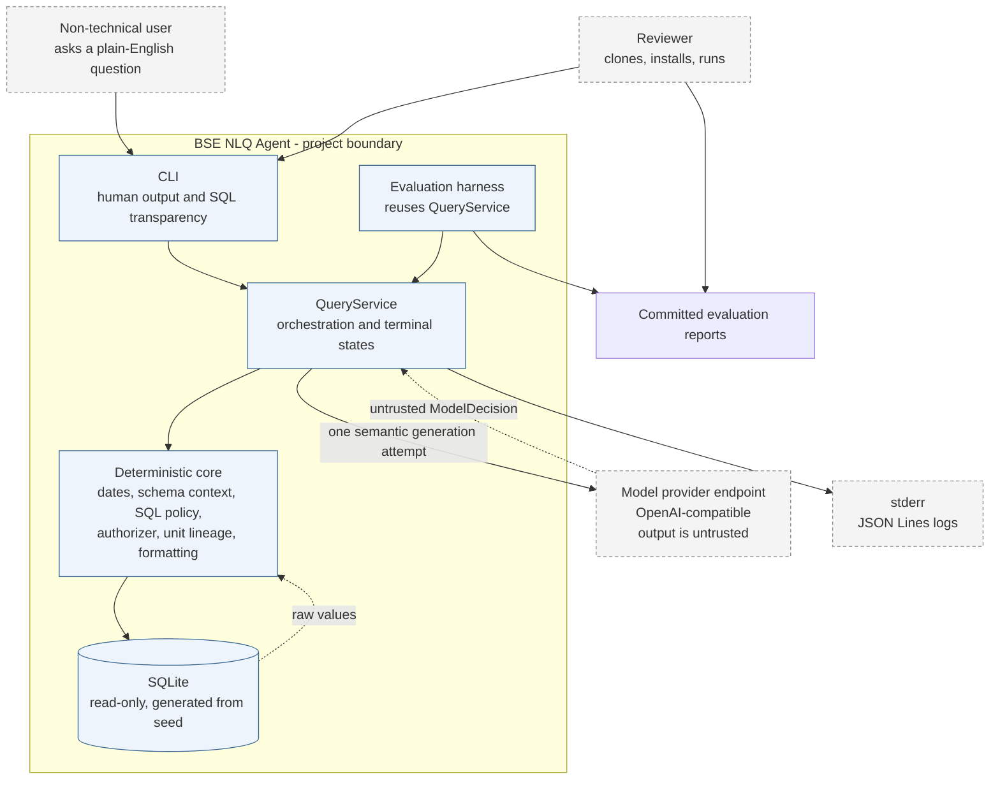

# System Context

> Approved design. The end-to-end CLI product path is implemented.

| Source | Trust |
|---|---|
| User question | Untrusted, delimited data |
| Model response | Untrusted; schema enforcement covers shape only |
| Introspected database schema | Trusted structural source |
| Version-controlled semantic metadata | Trusted business source |
| Application code | Trusted |

The model provider is the only network dependency. The database is generated locally, tests never contact a provider, logs use stderr, and evaluation artifacts are committed only after they exist.
